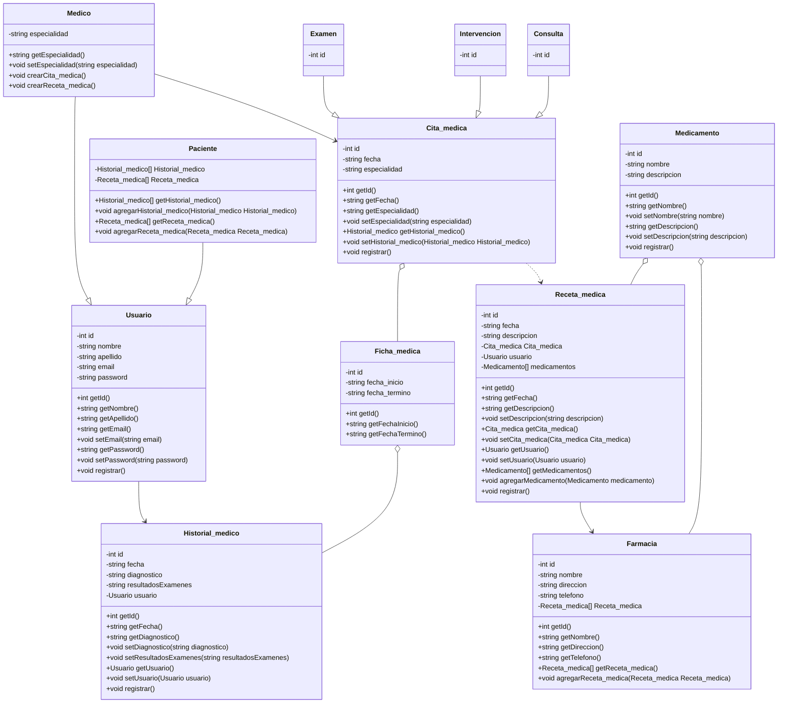

```mermaid
classDiagram

  Usuario --> Historial_medico
  Cita_medica o-- Ficha_medica
  Ficha_medica o-- Historial_medico
  Medico --> Cita_medica
  Cita_medica ..> Receta_medica
  Examen --|> Cita_medica
  Intervencion --|> Cita_medica
  Consulta --|> Cita_medica
  Medicamento o-- Receta_medica
  Medico --|> Usuario
  Paciente --|> Usuario
  Receta_medica --> Farmacia
  Medicamento o-- Farmacia

  class Usuario {
    -int id
    -string nombre
    -string apellido
    -string email
    -string password
    +int getId()
    +string getNombre()
    +string getApellido()
    +string getEmail()
    +void setEmail(string email)
    +string getPassword()
    +void setPassword(string password)
    +void registrar()
  }
  
  class Historial_medico {
    -int id
    -string fecha
    -string diagnostico
    -string resultadosExamenes
    -Usuario usuario
    +int getId()
    +string getFecha()
    +string getDiagnostico()
    +void setDiagnostico(string diagnostico)
    +void setResultadosExamenes(string resultadosExamenes)
    +Usuario getUsuario()
    +void setUsuario(Usuario usuario)
    +void registrar()
  }

  class Ficha_medica{
    -int id
    -string fecha_inicio
    -string fecha_termino
    +int getId()
    +string getFechaInicio()
    +string getFechaTermino()
  }
  
  class Cita_medica {
    -int id
    -string fecha
    -string especialidad
    +int getId()
    +string getFecha()
    +string getEspecialidad()
    +void setEspecialidad(string especialidad)
    +Historial_medico getHistorial_medico()
    +void setHistorial_medico(Historial_medico Historial_medico)
    +void registrar()
  }

  class Examen {
    -int id
  }

  class Intervencion {
    -int id
  }

  class Consulta {
    -int id

  }
  
  class Receta_medica {
    -int id
    -string fecha
    -string descripcion
    -Cita_medica Cita_medica
    -Usuario usuario
    -Medicamento[] medicamentos
    +int getId()
    +string getFecha()
    +string getDescripcion()
    +void setDescripcion(string descripcion)
    +Cita_medica getCita_medica()
    +void setCita_medica(Cita_medica Cita_medica)
    +Usuario getUsuario()
    +void setUsuario(Usuario usuario)
    +Medicamento[] getMedicamentos()
    +void agregarMedicamento(Medicamento medicamento)
    +void registrar()
  }
  
  class Medicamento {
    -int id
    -string nombre
    -string descripcion
    +int getId()
    +string getNombre()
    +void setNombre(string nombre)
    +string getDescripcion()
    +void setDescripcion(string descripcion)
    +void registrar()
  }
  
  class Medico {
    -string especialidad
    +string getEspecialidad()
    +void setEspecialidad(string especialidad)
    +void crearCita_medica()
    +void crearReceta_medica()
  }
  
  class Paciente {
    -Historial_medico[] Historial_medico
    -Receta_medica[] Receta_medica
    +Historial_medico[] getHistorial_medico()
    +void agregarHistorial_medico(Historial_medico Historial_medico)
    +Receta_medica[] getReceta_medica()
    +void agregarReceta_medica(Receta_medica Receta_medica)
  }
  
  class Farmacia {
    -int id
    -string nombre
    -string direccion
    -string telefono
    -Receta_medica[] Receta_medica
    +int getId()
    +string getNombre()
    +string getDireccion()
    +string getTelefono()
    +Receta_medica[] getReceta_medica()
    +void agregarReceta_medica(Receta_medica Receta_medica)
  }
  

```